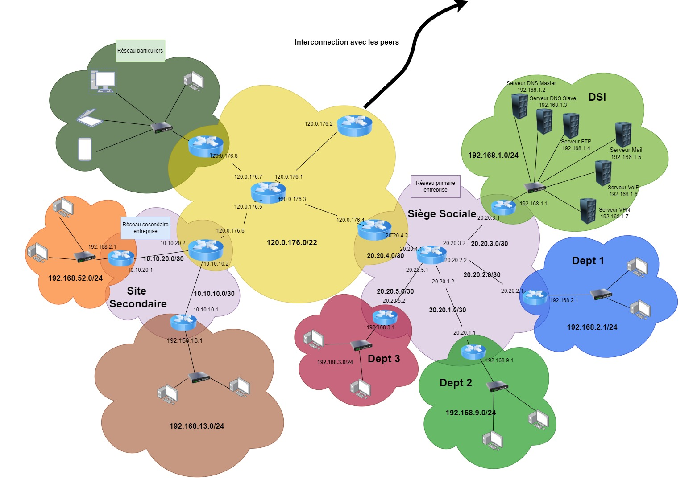

### Multi-Site Enterprise Network Implementation with Docker Containers


---

#### **Project Overview**
This project focuses on the implementation of a multi-site enterprise network using Docker containers to simulate network services and employee machines. The network architecture is based on the provided interconnection diagram, which incorporates multiple departments, a central office (Siège Sociale), and secondary sites interconnected via Autonomous Systems (AS).

The project involves creating and interconnecting multiple network segments, deploying essential network services, and ensuring secure communication between components.

---

#### **Objective**
- Design and deploy a scalable and secure multi-site network using Docker containers.
- Implement key services such as DNS, VoIP, VPN, Mail, FTP, and dynamic addressing.
- Simulate employee workstations and private user access to the enterprise network.
- Use Docker for service isolation, reproducibility, and portability.

---

#### **Compatibility with Requirements**
This implementation adheres to the project's requirements outlined in the **PDF** file:
1. **Autonomous Systems (AS):**
   - Each AS will be implemented with dynamic routing protocols (e.g., OSPF or BGP) inside Docker containers.
   - Each AS will manage its IP space and interconnect to other AS using peer links.
   - Services like DNS, Internet access, and specific configurations for enterprise networks will be deployed within AS.

2. **Enterprise Networks:**
   - The primary and secondary enterprise sites will be implemented within their AS.
   - Services like dynamic addressing, internal network security, VoIP, VPN, DNS, and file sharing will be deployed in Dockerized environments.
   - Site-to-site VPN connections will ensure secure communication.

3. **Individual Users:**
   - Individual users (e.g., "Réseau particuliers") will be simulated to access the enterprise network securely.
   - Docker containers will simulate box-like devices for private users.

4. **Security and QoS:**
   - Quality of Service (QoS) rules will prioritize traffic for enterprise-critical services.
   - Secure connections will be implemented using VPN and firewalls.

---

#### **Architecture Overview**
Refer to the attached diagram for the network architecture. Key elements include:

1. **Central Office (Siège Sociale):**
   - Services: DNS, FTP, Mail, VoIP, VPN
   - Subnet: `192.168.1.0/24`

2. **Departments (Dept 1, Dept 2, Dept 3):**
   - Each department has its own subnet (e.g., `192.168.2.0/24` for Dept 1).
   - Services and employees' machines will run in Docker containers.

3. **Secondary Sites:**
   - Site-secondary communication will be established using VPN.
   - Each secondary site (e.g., `192.168.52.0/24`) has its subnet and specific services.

4. **Autonomous Systems (AS):**
   - Main AS range: `120.0.176.0/22`
   - Peer interconnections and subnet delegation based on the diagram.

---

#### **Technology Stack**
- **Docker**: To containerize all services and simulate employee workstations.
- **Docker Compose**: For defining and running multi-container Docker applications.
- **Routing Protocols**: Implemented using containers (e.g., FRRouting for OSPF/BGP).
- **VPN**: WireGuard or OpenVPN for secure connections between sites.
- **QoS Tools**: tc (Traffic Control) to implement traffic prioritization.

---

#### **Setup Instructions**
1. Clone the repository:
   ```bash
   git clone https://github.com/ayoubte/projet-inter
   cd multi-site-network
   ```

2. Install Docker and Docker Compose:
   - Docker: [Installation Guide](https://docs.docker.com/get-docker/)
   - Docker Compose: [Installation Guide](https://docs.docker.com/compose/install/)

3. Build and start the Docker containers:
   ```bash
   docker-compose up --build
   ```

4. Configure routing:
   - Ensure routing between containers mimics the network diagram.
   - Use tools like `iptables` or `FRRouting`.

5. Verify connectivity:
   - Test site-to-site VPN communication.
   - Ping services from employee machines.

6. Simulate employees:
   - Containers representing employee machines can access services and communicate across sites.

---

#### **Evaluation Criteria**
This project is evaluated based on:
- Proper implementation of network architecture.
- Functionality of deployed services (DNS, VPN, VoIP, etc.).
- Security measures and QoS configuration.
- Final demonstration and presentation.

---

#### **Contributors**
- Group Members: Baita Enzo, Errachidi Abdelgafour, SAMI Ayoub, Zuiri Sami and Marine

---

#### **License**
This project is licensed under the MIT License. See the LICENSE file for details.

